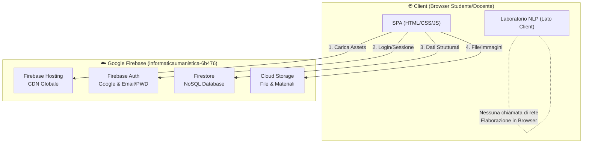

# 🏛️ Architettura del Progetto — InformaticaUmanistica

Il progetto adotta un'architettura Serverless basata su Firebase, con una SPA (Single Page Application) scritta in Vanilla JS. L'obiettivo è massimizzare le performance, azzerare la complessità di build tools esterni e operare in modo completamente gratuito sfruttando il piano **Firebase Spark**.

## 📊 Overview Architettura Firebase



## 🧩 Client-Side SPA

L'interfaccia utente è progettata senza l'uso di framework reattivi complessi (es. React/Vue), ma sfrutta moderni paradigmi Vanilla JS:
- **Design System CSS**: Basato su variabili CSS (`:root`), supporto nativo per tema Dark/Light e animazioni CSS per il "Glassmorphism".
- **Moduli JS**: I file JS sono suddivisi logicamente (Config, Auth, Core App, Lab) per una facile manutenibilità.
- **Strumenti NLP Edge**: Il "Laboratorio Interattivo" esegue le analisi del testo (conteggi, leggibilità, sentiment) interamente nel browser del client sfruttando le capacità computazionali del dispositivo locale.

## 💾 Modello Dati (Firestore Schema)

Firestore è strutturato in collezioni ottimizzate per query superficiali rapide:

### `users`
```json
{
  "uid_123": {
    "displayName": "Mario Rossi",
    "email": "mario.rossi@scuola.it",
    "role": "studente", // o "docente"
    "photoURL": null,
    "createdAt": "timestamp",
    "lastAccess": "timestamp",
    "analysesCount": 0
  }
}
```

### `contenuti` / `compiti`
```json
{
  "doc_123": {
    "title": "Analisi Divina Commedia",
    "body": "...",
    "authorId": "uid_docente",
    "createdAt": "timestamp",
    "targetAudience": "class_name"
  }
}
```

### `consegne`
```json
{
  "delivery_123": {
    "taskId": "doc_123",
    "studenteId": "uid_studente",
    "fileUrl": "gs://...",
    "submittedAt": "timestamp",
    "grade": null
  }
}
```

## 📈 Scalabilità e Costi (Piano Spark)

L'architettura è pensata per minimizzare i costi e restare pienamente operativa all'interno del Tier Gratuito (Spark):
- **Hosting**: Caching aggressivo delle risorse statiche (immagini 30 giorni, CSS/JS 1 giorno) configurato nel `firebase.json` per limitare il bandwidth.
- **Firestore**: Il piano Spark offre fino a 50.000 letture al giorno. Trattandosi di un'app per istituto scolastico (flussi di traffico previsti: centinaia di studenti), il limite è ampiamente sufficiente.
- **Compute Offloading**: Tutti gli algoritmi del laboratorio girano localmente (`lab.js`), abbattendo a zero l'uso e il costo potenziale delle Cloud Functions, che di fatto non sono necessarie per questa infrastruttura.
